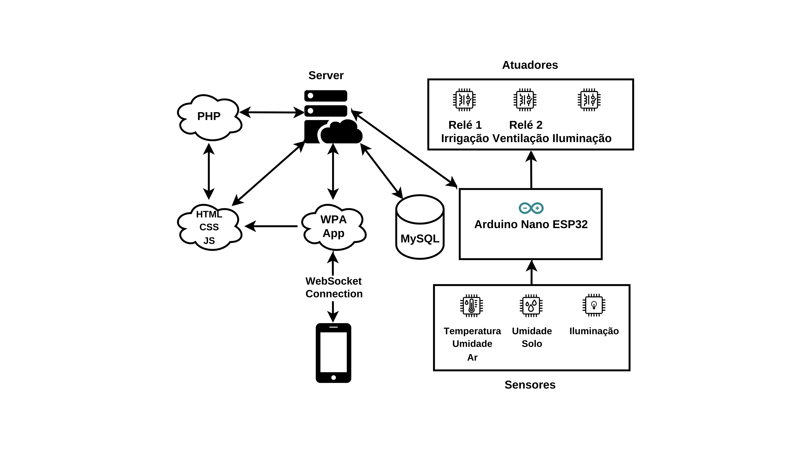
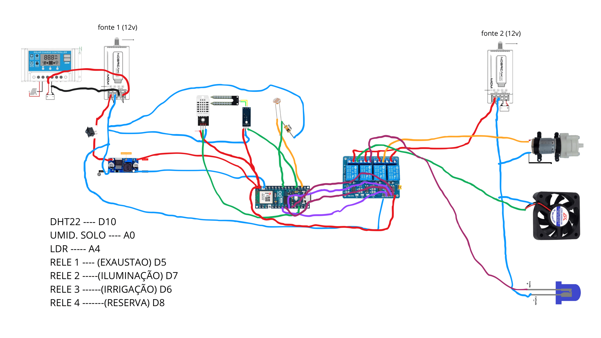

# 🌱 Estufa Inteligente

Sistema de monitoramento e controle de estufa agrícola com automação via IoT, desenvolvido com ESP32, servidor WebSocket em PHP e interface web moderna.

---

## 📋 Índice

- [Sobre o Projeto](#sobre-o-projeto)
- [Arquitetura](#arquitetura)
- [Tecnologias](#tecnologias)
- [Pré-requisitos](#pré-requisitos)
- [Clonando o Repositório](#clonando-o-repositório)
- [Como Rodar o Projeto](#como-rodar-o-projeto)
  - [1. Backend (PHP WebSocket)](#1-backend-php-websocket)
  - [2. Frontend (Interface Web)](#2-frontend-interface-web)
  - [3. Hardware (Arduino/ESP32)](#3-hardware-arduinoesp32)
- [Funcionalidades](#funcionalidades)
- [Estrutura de Pastas](#estrutura-de-pastas)
- [Configuração de Rede](#configuração-de-rede)

---

## Sobre o Projeto

A **Estufa Inteligente** é um sistema IoT para automação e monitoramento de estufas agrícolas. Ela coleta dados ambientais em tempo real (temperatura, umidade do ar, umidade do solo e luminosidade) através de sensores conectados a um ESP32 e exibe essas informações em um dashboard web. O sistema permite tanto o controle **automático** (baseado em regras predefinidas) quanto o controle **manual** dos atuadores (relés de irrigação, ventilação e iluminação).

---

## Arquitetura

<div align="left">
  
</div>

```
[ESP32 + Sensores] <──WebSocket──> [Servidor PHP] <──WebSocket──> [Interface Web]
```

A comunicação entre todos os componentes é feita via **WebSocket**. O servidor PHP atua como um hub central, retransmitindo as mensagens recebidas para todos os clientes conectados.

---

## Tecnologias

### Backend
- **PHP** com a biblioteca [Ratchet](http://socketo.me/) para servidor WebSocket

### Frontend
- **Vite** — ferramenta de build
- **JavaScript** (ES Modules)
- **TailwindCSS** — estilização
- **Highcharts** — gráfico de histórico de temperatura e umidade
- **ESLint** — qualidade de código

### Hardware
- **ESP32** (Arduino framework)
- **DHT22** — sensor de temperatura e umidade do ar
- **Sensor capacitivo de umidade do solo**
- **LDR** — sensor de luminosidade
- **4 Relés** — controle de irrigação, ventilação e iluminação
- Bibliotecas: `WiFi.h`, `ArduinoWebsockets`, `DHT`

---

## Pré-requisitos

Certifique-se de ter instalado antes de começar:

| Ferramenta | Versão mínima | Download |
|---|---|---|
| **PHP** | 7.4 | [php.net](https://www.php.net/downloads) |
| **Composer** | qualquer | [getcomposer.org](https://getcomposer.org/) |
| **Node.js** | 18.x | [nodejs.org](https://nodejs.org/) |
| **npm** | incluído com Node.js | — |
| **Arduino IDE** | 2.x | [arduino.cc](https://www.arduino.cc/en/software) |

> 💡 Para verificar as versões instaladas:
> ```bash
> php -v
> composer -V
> node -v
> npm -v
> ```

---

## Clonando o Repositório

Clone o repositório
```bash
git clone https://github.com/gabclima/estufa-inteligente.git
```
Entre na pasta do projeto
```bash
cd estufa-inteligente
```

O repositório já contém as três partes do projeto nas suas respectivas pastas: `backend/`, `frontend/` e `hardware/`. As bibliotecas do Arduino estão inclusas em `hardware/Bibliotecas Arduino/`, então não é necessário baixá-las separadamente, só se atente em importa-las no Arduino IDE, no caminho .

---

## Como Rodar o Projeto

> ⚠️ **Importante:** Caso for rodar o projeto por fins didáticos demonstrativos, certifique-se de que o backend, o frontend e o ESP32 estejam na mesma rede local. Ajuste os endereços IP nas configurações antes de iniciar. Ou para uso mais avançado em que esteja separado a estufa do servidor, certifique-se de que os endereços IP estejam apontados corretamente.

### 1. Backend (PHP WebSocket)

O servidor WebSocket é responsável por intermediar a comunicação entre o frontend e o hardware.

Entre na pasta do backend
```bash
cd backend
```
Instale as dependências PHP
```bash
composer install
```
Inicie o servidor WebSocket
```bash
php websocket.php
```

O servidor ficará escutando na porta **81**. Caso precise mudar, altere o valor de **81** para a porta desejada na linha abaixo. Você verá mensagens no terminal indicando novas conexões.

> **Configuração de IP:** No arquivo `websocket.php`, localize a linha abaixo e substitua pelo IP da máquina onde o servidor está rodando:
> ```php
> $app = new Ratchet\App("SEU_IP_AQUI", 81, "0.0.0.0");
> ```

---

### 2. Frontend (Interface Web)

Entre na pasta do frontend
```bash
cd frontend
```
Instale as dependências
```bash
npm install
```

Inicie o servidor de desenvolvimento
```bash
npm run dev
```

Acesse a interface em `http://localhost:3000` (ou a porta exibida no terminal, por padrão é a porta 3000).

> **Configuração do WebSocket:** No arquivo `frontend/src/pages/dashboard.js`, atualize o endereço do servidor WebSocket:
> ```js
> const socket = new CustomWebsocket("ws://SEU_IP_DO_SERVIDOR:81");
> ```

**Para verificar problemas de lint:**
```bash
npx eslint src/
```

**Para adicionar novas páginas:**

1. Crie o componente no diretório `src/pages/`.
2. Importe-o em `src/main.js`.
3. Adicione a rota ao objeto `routes`:

```js
import MinhaPagina from "./pages/minhaPagina";

const routes = {
  "/": HomePage,
  "/minha-pagina": MinhaPagina,
};
```

---

### 3. Hardware (Arduino/ESP32)

1. Abra o arquivo `.ino` localizado na pasta `hardware/` com a **Arduino IDE**.

2. Importe as bibliotecas necessárias presentes na pasta `hardware/Bibliotecas Arduino`:
   - `DHT-sensor-library-master.zip`
   - `ArduinoWebsockets-master.zip`

   > No Arduino IDE: **Sketch → Incluir Biblioteca → Adicionar biblioteca .ZIP** e selecione cada arquivo.

3. Atualize as credenciais de rede e o endereço do servidor no início do código:

```cpp
const char* ssid     = "NOME_DA_SUA_REDE";
const char* password = "SENHA_DA_REDE";
const char* websocketServer = "ws://IP_DO_SERVIDOR:81";
```

4. Conecte o ESP32 ao computador, selecione a placa e porta corretas na Arduino IDE e faça o upload do código.

**Pinagem utilizada:**

| Componente              | Pino ESP32 |
|-------------------------|------------|
| Sensor DHT22            | 10         |
| Sensor de Umidade Solo  | A0         |
| Sensor LDR              | A4         |
| Relé 1 (Irrigação)      | 8          |
| Relé 2 (Ventilação)     | 7          |
| Relé 3 (Iluminação)     | 5          |
| Relé 4                  | 6          |

**Diagrama de ligação elétrica:**

<div align="left">
  
</div>

---

## Funcionalidades

- 📊 **Dashboard em tempo real** com leituras de temperatura, umidade do ar, umidade do solo e luminosidade
- 📈 **Gráfico histórico** de temperatura e umidade (últimos 30 pontos)
- 🔄 **Modo automático**: o ESP32 aciona os relés automaticamente com base nos sensores:
  - Umidade do solo < 30% → liga irrigação
  - Temperatura > 29°C → liga ventilação
  - Luminosidade < 40% → liga iluminação
- 🕹️ **Modo manual**: controle individual de cada relé pela interface web

---

## Estrutura de Pastas

```
estufa-inteligente/
├── backend/                        # Servidor WebSocket em PHP
│   ├── websocket.php
│   └── vendor/                     # Dependências (gerado pelo Composer)
├── frontend/                       # Interface web
│   ├── src/
│   │   ├── pages/                  # Páginas da aplicação
│   │   │   └── dashboard.js
│   │   ├── constants/              # Constantes e rotas
│   │   └── main.js                 # Ponto de entrada e roteamento
│   ├── package.json
│   └── vite.config.js
└── hardware/                       # Código do ESP32 (Arduino)
    ├── estufa.ino
    └── Bibliotecas Arduino/        # Bibliotecas prontas para importar
        ├── DHT-sensor-library-master.zip
        └── ArduinoWebsockets-master.zip
```

---

## Configuração de Rede

Para que o sistema funcione corretamente, os IPs devem ser configurados de forma consistente em todos os componentes:

| Arquivo                           | Variável/Linha                   | Valor esperado              |
|-----------------------------------|----------------------------------|-----------------------------|
| `backend/websocket.php`           | `new Ratchet\App(...)`           | IP da máquina do servidor   |
| `frontend/src/pages/dashboard.js` | `new CustomWebsocket(...)`       | `ws://IP_DO_SERVIDOR:81`    |
| `hardware/estufa.ino`             | `websocketServer`                | `ws://IP_DO_SERVIDOR:81`    |
| `hardware/estufa.ino`             | `ssid` / `password`              | Credenciais do Wi-Fi        |
